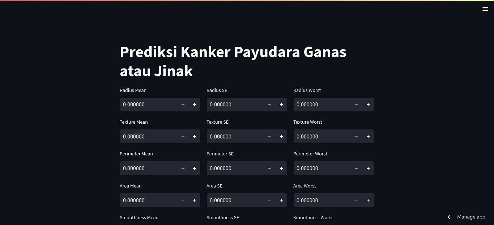

# Breast Cancer Prediction

This is a web app to predict breast cancer is malignant or benign using decision tree algorithm.

## Table of contents

- [Overview](#overview)
  - [Screenshot](#screenshot)
  - [Links](#links)
- [My process](#my-process)
  - [Built with](#built-with)
- [Author](#author)

## Overview

### Screenshot

### Links

- Live Site URL: [Live site URL](https://ijuldev-breast-cancer-prediction-stream-breast-cancer-s7av0s.streamlit.app/)

## My process

### Built with

- Pandas
- NumPy
- Scikit-learn
- Streamlit

## Author

- Instagram - [@zulfikar.pinem](https://www.instagram.com/zulfikar.pinem)
- Facebook - [@mhd.zulfikar.pinem](https://www.facebook.com/mhd.zulfikar.pinem)
